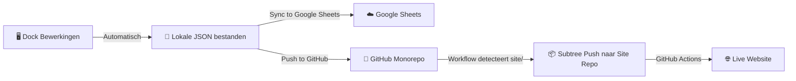

# 🔄 Athena Dock — Save & Publish Protocol

> **Doel:** Zorgen dat alle wijzigingen correct worden opgeslagen op drie niveaus:  
> Lokale bestanden → Google Sheets (cloud backup) → GitHub (live website)

---

## Overzicht: De Drie Opslaglagen



---

## Stap-voor-Stap Protocol

### Stap 1: Bewerkingen maken (Automatisch opgeslagen)

| Wat | Hoe |
|---|---|
| **Tekst aanpassen** | Shift+Klik op tekst in de preview → Modal opent → Wijzig → **SAVE CHANGES** |
| **Velden verbergen/tonen** | Klik op het 👁️ oogje naast een veld in de sidebar |
| **Velden inline zetten** | Klik op het ↔️ pijltje naast een veld in de sidebar |
| **Padding aanpassen** | Gebruik de padding slider per sectie |
| **Secties verbergen/tonen** | Klik op het 👁️ oogje naast een sectie |
| **Layout wijzigen** | Kies grid/list/z-pattern/focus per sectie |
| **Items toevoegen/verwijderen** | Gebruik de + en 🗑️ knoppen per sectie |

> [!IMPORTANT]
> **Elke bewerking wordt AUTOMATISCH opgeslagen naar de lokale JSON-bestanden** (`src/data/*.json`).  
> Je hoeft hiervoor GEEN knop in te drukken. De Dock schrijft direct naar schijf via de Vite dev-server API.

> [!NOTE]
> Gebruik **Undo / Redo** (knoppen linksboven, of Ctrl+Z / Ctrl+Y) als je een fout maakt.  
> De geschiedenis bevat maximaal 20 acties.

---

### Stap 2: Sync to Google Sheets ☁️

**Knop:** De groene **"Sync to Google Sheets"** knop in de rechter sidebar.

| Eigenschap | Detail |
|---|---|
| **Wat doet het?** | Stuurt de huidige lokale JSON-data naar Google Sheets als cloud-backup |
| **Wanneer gebruiken?** | Nadat je klaar bent met een sessie van bewerkingen |
| **Richting** | Lokaal → Cloud (eenrichtingsverkeer) |
| **Overschrijft het de Sheet?** | Ja, de lokale data vervangt de Sheet-data |
| **Governance Mode** | In "Client Mode" is deze knop geblokkeerd (🔒) |

> [!WARNING]  
> **Sync to Google Sheets** overschrijft de huidige Sheet-inhoud met jouw lokale wijzigingen.  
> Als iemand anders ondertussen de Sheet heeft aangepast, gaan die wijzigingen verloren.

**Omgekeerd — Pull from Google Sheets:**  
De witte **"Pull from Google Sheets"** knop haalt data OP uit de Sheet en overschrijft je lokale bestanden.  
Er wordt automatisch een backup gemaakt in de site-map.

> [!CAUTION]
> **Pull from Google Sheets** overschrijft al je lokale wijzigingen!  
> Gebruik dit alleen als je zeker weet dat de Sheet de meest actuele versie bevat.

---

### Stap 3: Push to GitHub 🚀

**Knop:** De paarse **"Push to GitHub"** knop in de header-balk (rechtsboven).

| Eigenschap | Detail |
|---|---|
| **Wat doet het?** | Commit en pusht alle wijzigingen naar de `athena-x` monorepo op GitHub |
| **Commit bericht** | Er verschijnt een prompt waar je een beschrijving kunt invullen |
| **Automatische subtree** | GitHub Actions detecteert wijzigingen in `sites/` en pusht elke gewijzigde site als subtree naar zijn eigen repo |
| **Live deployment** | De site-repo heeft een eigen workflow die automatisch de site bouwt en publiceert |

> [!NOTE]
> Als de site nog **nooit** is gedeployd, zie je in plaats van "Push to GitHub" een oranje **"Deploy to GitHub"** knop.  
> Deze maakt eerst een nieuwe GitHub repository aan en doet dan de eerste push.

---

## 📋 Checklist: Correcte Volgorde

Volg deze volgorde **altijd** bij het afsluiten van een bewerkingssessie:

```
┌─────────────────────────────────────────────────┐
│  ✅ 1. Controleer je wijzigingen in de Preview  │
│        → Gebruik "⟳ Refresh Preview" als nodig  │
│                                                  │
│  ✅ 2. Sync to Google Sheets                    │
│        → Groene knop in de sidebar              │
│        → Wacht op "✅ Succesvol" melding        │
│                                                  │
│  ✅ 3. Push to GitHub                           │
│        → Paarse knop in de header               │
│        → Vul een duidelijk commit bericht in    │
│        → Wacht op "✅ Gepusht" melding          │
│                                                  │
│  ✅ 4. Controleer de live site (optioneel)      │
│        → Groene "Live" knop in de header        │
│        → Wacht 1-2 minuten voor GitHub Actions  │
└─────────────────────────────────────────────────┘
```

---

## Overzicht Knoppen

| Knop | Locatie | Kleur | Functie |
|---|---|---|---|
| **⟳ Refresh Preview** | Header | Grijs | Herlaadt de iframe-preview |
| **Preview** | Header | Blauw | Opent lokale site in nieuw tabblad |
| **Live** | Header | Groen | Opent live productie-site |
| **Push to GitHub** | Header | Paars | Commit + push naar monorepo |
| **GitHub** | Header | Grijs | Opent GitHub repo |
| **Sync to Google Sheets** | Sidebar | Groen | Push lokale data → Sheets |
| **Pull from Google Sheets** | Sidebar | Wit | Pull Sheet data → lokaal |
| **Undo / Redo** | Header | Donker | Laatste actie ongedaan maken |

---

## Veelgemaakte Fouten

| Fout | Gevolg | Oplossing |
|---|---|---|
| Pushen naar GitHub zonder eerst te syncen naar Sheets | Sheets raakt uit sync met de live site | Altijd eerst Sync, dan Push |
| Pull from Sheets doen na lokale wijzigingen | Lokale wijzigingen worden overschreven | Eerst Sync doen als je lokale wijzigingen wilt behouden |
| Vergeten te pushen na bewerkingen | Wijzigingen bestaan alleen lokaal | Push altijd aan het einde van een sessie |
| Browser sluiten tijdens Sync/Push | Operatie kan halfweg stoppen | Wacht altijd op de bevestigingsmelding |

---

## Architectuur: Hoe de Monorepo Werkt

```
athena-x (monorepo)
├── factory/          ← Athena Dashboard (poort 5001)
├── dock/             ← Athena Dock (poort 5002)
├── sites/
│   ├── de-schaar-site/   ← Site 1 (poort 6110)
│   ├── andere-site/      ← Site 2 (poort 61xx)
│   └── ...
└── .github/workflows/
    └── subtree-push.yml  ← Detecteert site-wijzigingen → subtree push
```

**Bij `git push` naar `athena-x`:**
1. GitHub Actions workflow start
2. Controleert of er wijzigingen zijn in `sites/`
3. Voor elke gewijzigde site-map: subtree push naar eigen repo  
   (bijv. `sites/de-schaar-site/` → `athenacmsfactory/de-schaar-site`)
4. De site-repo's eigen workflow bouwt de productie-versie en publiceert deze
